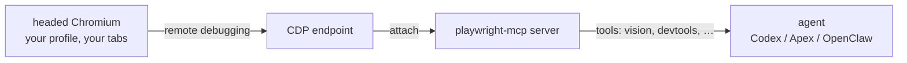

## Playwright MCP

<div align="right">


[](LICENSE)

</div>

> Fork note: this fork is maintained at `toxicwind/playwright-mcp` for a headed rebrowser workflow. Upstream remains the source of truth for the base server — this fork adds local operator ergonomics and auto-syncs from upstream `main`.

## Why should you care?

Stock Playwright MCP boots a fresh, isolated, throwaway browser every time — fine for CI, wrong for an operator. This fork is built around the opposite model: **one persistent headed Chromium you actually use, with your real logged-in profile and tabs**, and the MCP server attaches to it over CDP. No re-authing inside automation contexts, no losing your session between tool calls. Built for Codex / Apex / OpenClaw operator workflows where the browser is a workspace, not a sandbox.

**License:** [Apache-2.0](LICENSE) · **Security:** [SECURITY.md](SECURITY.md)

## Fork features

- **Persistent headed Chromium sessions** — the browser stays yours between calls
- **CDP attach to already-running windows** — `--cdp-endpoint` targets a live browser with remote debugging enabled
- **Rebrowser-friendly launch and session reuse** — real profiles, real tabs, real logins
- **Upstream-compatible** — base server tracks upstream `main` via auto-sync; fork preamble re-applies cleanly with `node apply-fork-preamble.js`
- **Fork-local launch helpers** — `sovereign-launch.js`, `launch-firefox-from-profile.sh`, `launch-firefox-remote.js`, `gate-runtime-extract.js`

## How it works



## Quick start

```bash
npx -y github:toxicwind/playwright-mcp --help
npx -y github:toxicwind/playwright-mcp --cdp-endpoint http://127.0.0.1:46677 --caps vision,devtools
```

(`@toxicwind/playwright-mcp` is **not on the npm registry yet** — trusted publishing is gated on the `NPM_CANARY_ENABLED` repo variable, so `npx @toxicwind/playwright-mcp@latest` 404s. The `github:` form above works today and becomes a drop-in replacement later.)

Local model: start a headed Chromium with remote debugging, point the server at it with `--cdp-endpoint`, reuse the real logged-in profile instead of reauthing in a throwaway context. Codex config example:

```toml
[mcp_servers.playwright]
command = "npx"
args = [
  "-y", "github:toxicwind/playwright-mcp",
  "--cdp-endpoint", "http://127.0.0.1:46677",
  "--caps", "vision,devtools",
]
```

## Dev

```bash
git clone https://github.com/toxicwind/playwright-mcp.git
cd playwright-mcp && npm install && node cli.js --help
```

- `node apply-fork-preamble.js` — re-applies this preamble to `README.md` after an upstream sync (idempotent; canonical source is `.github/fork-preamble.md`)
- `node update-readme.js` — README lint (`npm run lint`)
- `node roll.js` — upstream roll helper (`npm run roll`)
- Tests: `playwright test` (`--project=chrome|firefox|webkit|chromium-docker`)

## License & security

[Apache-2.0](LICENSE) (Microsoft Corporation, upstream; fork changes under the same license). Security policy: [SECURITY.md](SECURITY.md). Contributing: [CONTRIBUTING.md](CONTRIBUTING.md).
